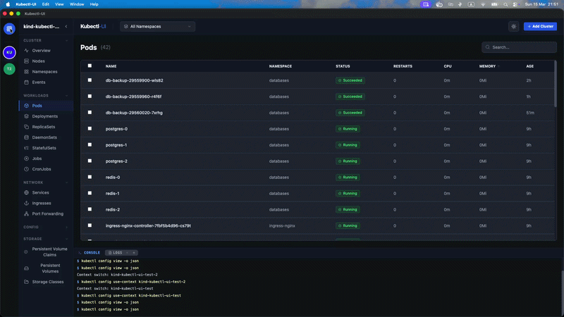
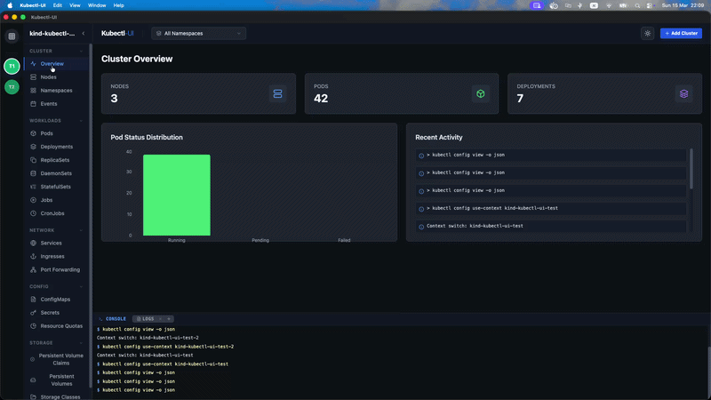
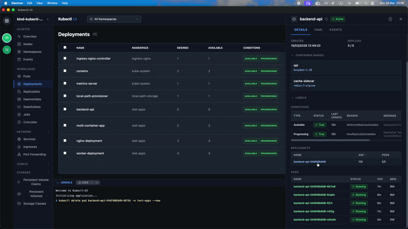
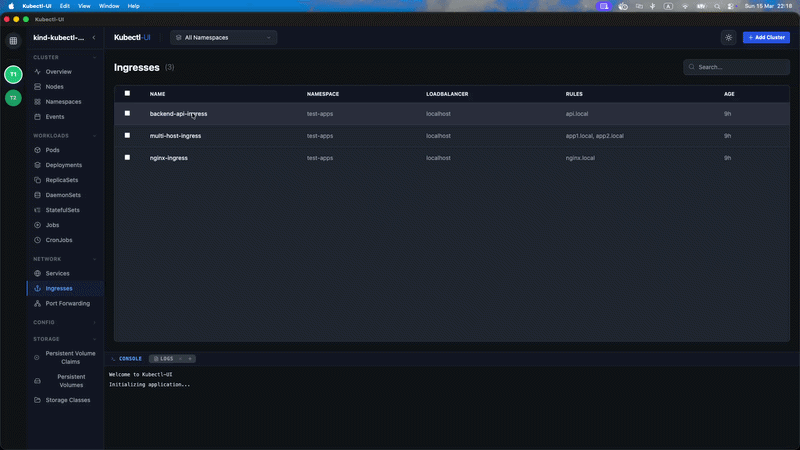
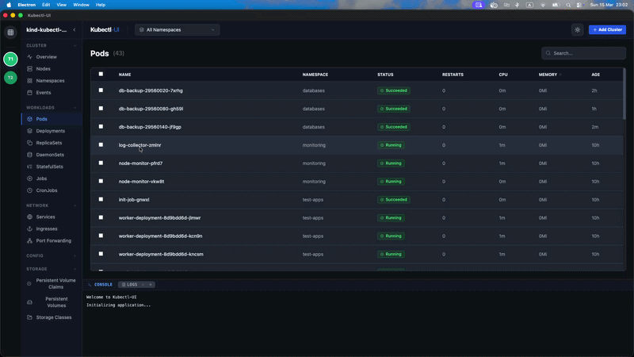
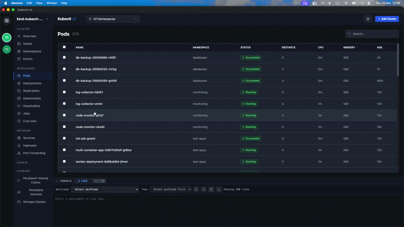
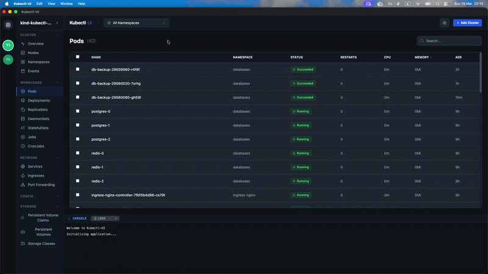
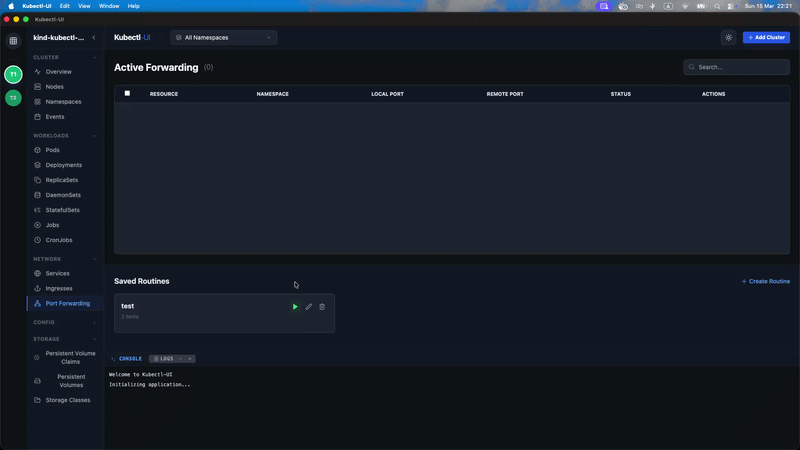
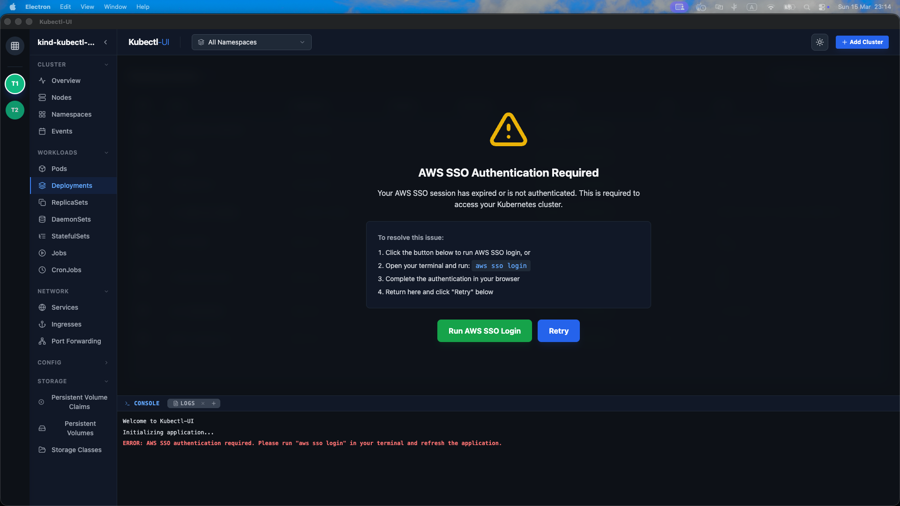

# Kubectl-UI Feature Showcase

## Cluster Management

Manage multiple Kubernetes clusters seamlessly from one unified dashboard.

## Resource Navigation

Navigate through cluster resources with an intuitive and organized interface.

## Pod Management

Easily view and manage your Kubernetes pods with powerful options at your fingertips.

## Integrated Terminal

Access a built-in terminal directly in the app for running kubectl commands.

## Deep Dive Resources

Explore detailed resource information with comprehensive views.

## Log Viewer

Stream and monitor pod logs in real-time with a dedicated log viewer.

## Smart Caching

Fast and efficient data fetching with intelligent caching strategies.

## Port Forwarding Routine Automation

Create and manage reusable routines to automate repetitive port forwarding tasks.

## Integrated AWS sso support

Detects and lets you run aws sso login directly from the tool.

---

## And many more!